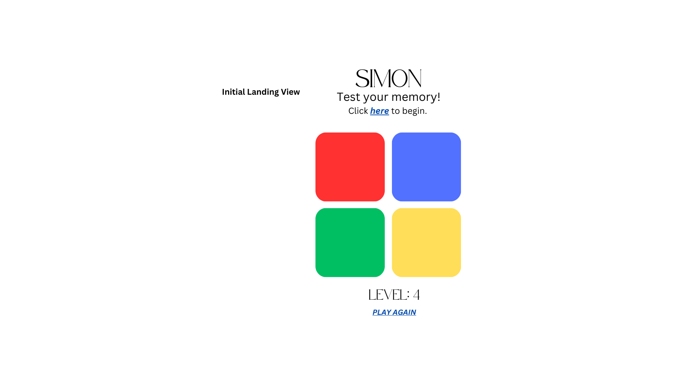

# SIMON
Simon is the game I chose to do for the first project.

## Project Description 

My app is called **SIMON**. It's a single player game for people who want to play Simon online. Players can test their memory in a fun and dynamic way with **SIMON**. One additional move is added during each level and the player must repeat the pattern exactly. The colors correspond with a tone and the player will have the option to mute the sound. The player's level will be being kept automatically. A display prompting the player to ***Try Again*** will pop up once the player loses. 

## Wire Frames

**Initial Landing View**



**Results View**


## User Stories

#### MVP Goals

- As a player, I want my game to generate different patterns every time the game starts/restarts.
- As a player, I would like to be informed when the game is over due to taking too long/selecting the wrong color.
- As a player, I would like to know which level I am on.
- As a player I would like to be able to restart the game after a loss or whenever.
- As a player, I want the UI to be simple and clear so that I can enjoy the experience of playing the game.

#### Stretch Goals

- As a player, I would like a moving animation for when I lose the game, so that I feel better about losing.
- As a player, I would like the option to play the game with sound or without soud.
- As a player, I would like the option to hear audible sounds when my selection is wrong or when I run out of time. 
-As a player, I would like a dark option, or a dark neon option with different sound options.
- Save high scores using localStorage

## Pseudocode
```js
// 1) Define any variables used to track the state of the game:

//    The computer generated pattern
//    Tracking the clicks of the user
//    The game started (boolean)
//    Timer element
//    Option to turn timer element off (boolean)
//    The audio muted(boolean)
//    A result message - display who won that round

// 2) Define the required constants:
//    There are only 4 color choices a player can make (red, blue, green, and yellow)
//    We'll need a reference to a DOM element to display messages

// 3) Handle a player clicking a button

// 4) Handle generating random selections for the pattern as well as continuing until the player makes a mistake.

// 5) Implement a timing element so that player has a certain amount of time to react to the pattern before losing.

// 6) Render lose message to the player 

```

#### Timeline - Daily Accountability


| Day        |   | Task                               | Blockers | Notes/ Thoughts |
|------------|---|------------------------------------|----------|-----------------|
| Monday     |   | Create and present proposal        |          |                 |
| Tuesday    |   | Complete html file                 |          |                 |
| Wednesday  |   | Work on JS file                    |          |                 |
| Thursday   |   | Complete JS file                   |          |                 |
| Friday     |   | Work on CSS                        |          |                 |
| Saturday   |   | Finalize MVP                       |          |                 |
| Sunday     |   | Work on stretch goals              |          |                 |
| Monday     |   | Presentation Day!                  |          |                 |
|            |   |                                    |          |                 |
