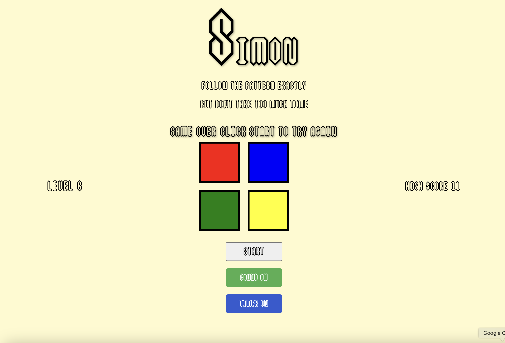

# Project-1

## SIMON
**SIMON** is a memory game. There is a randomly generated sequence of colors that the user is expected to repeat. One new color is added to the sequence as the levels progress. The user must select a color within a short time (if the timer option is on) otherwise they will lose the game and be prompted to start again. Each color corresponds with a specific sound as well and this can also be turned off if the player chooses to have a sound free experience. 

## Screenshot: 

## Getting started: 
1. [Deployed Link](https://rednaldeirf.github.io/Project-1/)
2. [Planning Materials](https://github.com/rednaldeirf/Project-1/blob/main/PROPOSAL.md)

## Attributions: 
* This is the [font citation](https://fontstruct.com/fontstructions/download/1595139).
* This is the [gameOverSound citation](https://pixabay.com/sound-effects/search/game-over/).
* This is the [color sounds citation](https://pixabay.com/sound-effects/).
* [This](https://codepen.io/microcyberz/full/rMqdNZ) version of **SIMON** served as inspiration for my version.

## Technologies used: 
JavaScript, HTML, CSS, and local storage were used to create **SIMON**.

## Next steps: 
In the future, I would like to: 
* Enhance the **UI** experience;
* Find better sound options;
* Add a *Neon Mode* with laser sounds;
* Make the color sequence more ***distinct***.
 
